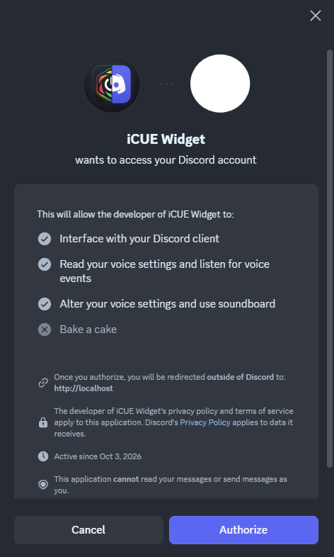

# Discord Voice Overview — Corsair iCUE Custom Widget & Bridge

A custom **Corsair iCUE 5 Widget** and **Local RPC Bridge** built for Corsair displays (including XENEON Edge) and iCUE dashboards. Displays real-time Discord voice channel status, active speaker green glow indicators, participant avatars, mute/deafen status, recent voice channel quick-rejoin cards, and touch-screen action controls.

---

## 🌟 Key Features

- **Live Voice Participants Grid:** Real-time avatars, display names, and mute/deafen badges.
- **Active Speaker Detection:** Native Discord green inset ring indicators around active speakers.
- **Header Profile Badge:** Shows your logged-in Discord account avatar & username top-right in the widget header.
- **Recent Channels Quick Rejoin:** Remembers your top recent voice channels for 1-touch joining when idle.
- **Touch-Friendly Controls:** Quick Mute, Deafen, and Leave Voice action buttons.
- **Custom UI Preferences:** Interactive sliders to adjust UI scaling (75%–150%) and custom card widths directly in iCUE.

---

## 📦 Requirements & Main Files

This project consists of two primary files:

1. **`discord-voice-overview.icuewidget`** — The widget interface loaded directly into Corsair iCUE.
2. **`icue-discord-bridge.exe`** — A lightweight, zero-dependency background process that connects Discord Desktop RPC to iCUE via a local WebSocket.

---

## 🚀 Quick Start & Installation

### Step 1: Install the Widget in iCUE
1. Double-click **`discord-voice-overview.icuewidget`** (or drag & drop it into **Corsair iCUE 5**).
2. In iCUE, navigate to your **Xeneon Edge** or Dashboard canvas and add the **Discord Voice Overview** widget.

---

### Step 2: Run the Local Bridge

1. Launch **`icue-discord-bridge.exe`**.
2. **First-Time Authorization Prompt:**
   When the bridge connects to Discord for the first time, Discord Desktop will display an in-app OAuth prompt asking to authorize access:

   

   Click **Authorize**. Once authorized, the widget in iCUE will instantly connect and display your live Discord status!

---

### 💡 Optional: Run Automatically on Windows Startup

If you want the bridge to start automatically whenever Windows boots:

1. Press `Win + R` on your keyboard to open the **Run** dialog.
2. Type **`shell:startup`** and press **Enter**.
3. Copy **`icue-discord-bridge.exe`** (or a shortcut to it) into the Startup folder.

> *Note: The executable PE header is pre-patched to run as a windowless background application. It will launch completely silently in the background with zero terminal window.*

---

## 🛑 How to Stop / Terminate the Bridge Process

If you ever need to stop or close the bridge background process:

1. Open **Windows Task Manager** (Press `Ctrl + Shift + Esc` or right-click the Windows Taskbar and select **Task Manager**).
2. Click the **Details** tab on the left or top navigation bar.
3. Scroll down or search for **`icue-discord-bridge.exe`**.
4. Right-click **`icue-discord-bridge.exe`** and select **End Task** (or **End Process**).

---

## 📁 Repository Structure

```text
icue-discord-widget/
├── discord-voice-overview.icuewidget    <-- Widget package for iCUE
├── icue-discord-bridge.exe              <-- Standalone background bridge binary
├── assets/                              <-- Documentation images & screenshots
│   └── discord-authorization.png        <-- First-time Discord OAuth authorization screenshot
├── icuewidget/                          <-- Frontend widget UI source (HTML/CSS/JS)
├── discord-bridge/                      <-- Backend bridge source (Node.js & Discord RPC)
└── package.json                         <-- Build scripts & CLI dependencies
```

---

## 🛠️ Building & Developing From Source

If you want to modify the source code or build the project yourself:

```bash
# Install dependencies
npm install

# Build widget bundle and package .icuewidget
npm run build

# Recompile standalone icue-discord-bridge.exe binary
cd discord-bridge
npx pkg index.js --target node16-win-x64 --output ../icue-discord-bridge.exe
```

---

## 📄 License
Distributed under the **MIT License**.
